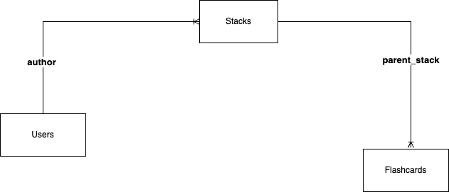

## API Structure

### Stacks - prefix("`/api/stacks`")
**GET** ``
returns all stacks for a particular user.

**POST** ``
create a new stack

**PUT** `/{stackId}`
update a stack

**DELETE** `{stackId}`
delete a stack with `stackId`

### Flashcards - prefix(`/api/stacks/{stackId}/flashcards`)
**GET** `` 
returns all flashcards for a particular stack.

**POST** `` 
create a new flashcard in stack with `{stackId}`

**PUT** `/{flashcardId}` 
update a flashcard 

**DELETE** `{flashCardId}` 
delete a flashcard with `{flashCardId}` in stack with  `{stackId}`

